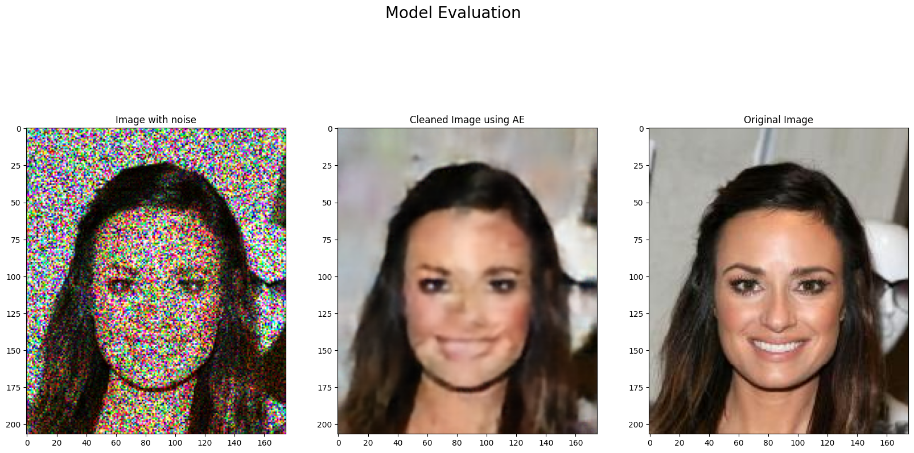

# 😎 Denoising Face Images using CNN Autoencoder

This project focuses on developing a Convolutional Neural Network (CNN) Autoencoder to remove noise from face images. The dataset used is the [CelebA dataset](https://www.kaggle.com/datasets/jessicali9530/celeba-dataset), which consists of celebrity face images. The goal is to train an autoencoder that can effectively clean noisy images while preserving important facial details.

## 🚀 Project Overview

- **Objective**: Develop a CNN Autoencoder to denoise face images.
- **Dataset**: CelebA dataset from Kaggle.
- **Architecture**: A deep convolutional autoencoder with encoding and decoding layers.
- **Output**: Cleaned images with reduced noise.

## 🗂️ Dataset

- The dataset contains images of celebrities, each of size 178x218 pixels.
- **Download**: You can download the dataset using the Kaggle API:
  ```bash
  kaggle datasets download -d jessicali9530/celeba-dataset
  ```
- **Extract**: After downloading, extract the dataset into the `data/` directory.


## 📊 Model Architecture

The autoencoder consists of:

- **Encoder**: Series of convolutional layers with ReLU activations and max-pooling to downsample the image.
- **Bottleneck**: The compressed representation of the image.
- **Decoder**: Series of convolutional transpose layers to upsample and reconstruct the image.

## 🖼️ Results

The following images show examples of noisy input, the denoised output, and the original clean image:


|------------------------|
|  |
|------------------------|
|  | 
|------------------------|
|  |

## 🧠 How It Works

1. **Add Noise**: Noise is artificially added to clean images.
2. **Train the Model**: The autoencoder is trained to minimize the difference between the original clean image and the denoised output.
3. **Evaluate**: The model is evaluated based on how well it reconstructs the clean image from the noisy input.


## 🤝 Contributions

Feel free to fork this repository, create a feature branch, and submit a pull request! Contributions are always welcome. 


## ✨ Acknowledgments

- The CelebA dataset authors.
- The open-source community for providing useful tools and resources.
```
